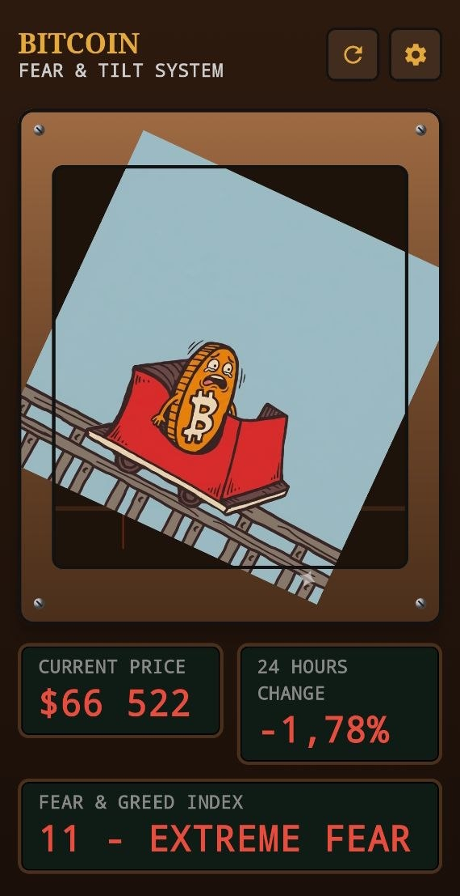
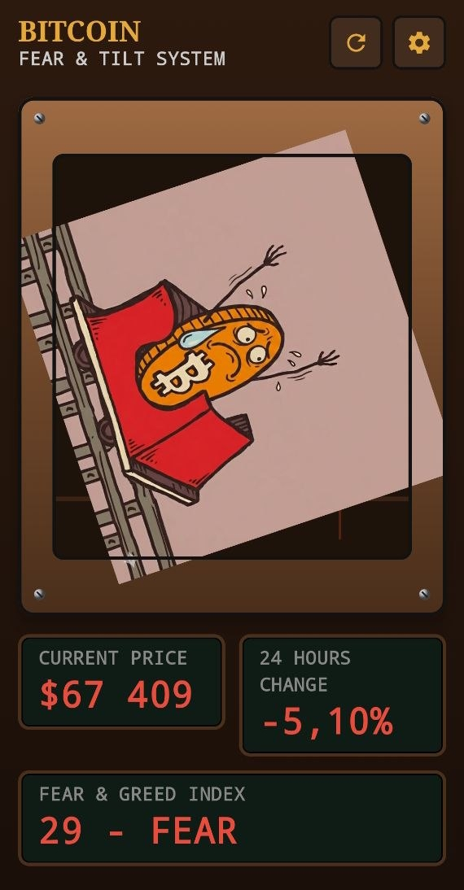
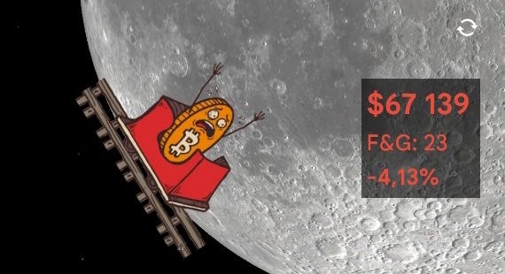
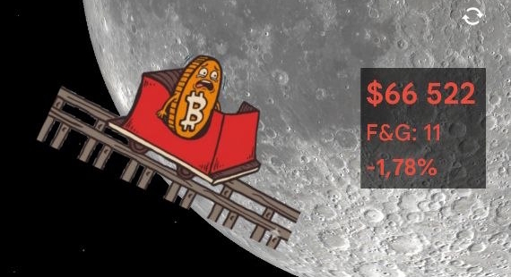

# 🚂 Bitcoin Fear & Tilt

*Languages: [English](README.md) | [中文](README_zh.md)*


**Bitcoin Fear & Tilt** 是一款专为实时跟踪比特币价格动态和市场“恐慌与贪婪指数”而设计的 Android 应用程序。它没有使用枯燥的财务图表，而是通过交互式动画让市场变得栩栩如生：

- 🎢 **动态矿车：** 矿车的倾斜度会根据价格变化的速度和方向（价格动态）而改变。
- 😱 **市场情绪：** 比特币硬币上的表情会根据当前的“恐慌与贪婪指数”而变化。
- 🚀 **极端波动：** 如果价格剧烈波动，背景会切换为高速运动模糊效果，硬币会像在真正的过山车上一样举起双手！

> [!TIP]
> 该应用程序既可作为全面的全屏仪表板运行，也可作为**高度可定制的主屏幕小组件**。

<p align="center">
  
  
</p>

## 🌟 主要功能

- **交互式动画：** 界面通过上述视觉机制响应市场波动和情绪。
- **复古 LCD 显示屏：** 提供实时指标，包括当前资产价格、百分比变化和准确的恐慌与贪婪指数值。
- **高级定制：** 用户可以配置跟踪时间范围（30分钟、24小时、从午夜开始）、调整倾斜灵敏度并定义自定义情绪指数阈值。
- **主屏幕小组件：** 将基本的市场数据（价格、指数、趋势）直接传送到您的主屏幕以便立即访问。
- **动态启动器图标：** 应用程序图标会在系统启动器中以编程方式更新其视觉状态，以反映当前的市场状况。
- **多语言支持：** 完全本地化为英语、俄语、西班牙语、中文和法语。

## 📱 主屏幕小组件

在您的主屏幕上部署一个轻量级、自动更新的小组件。它具有可自定义的背景透明度，以确保与任何系统壁纸无缝集成。

<p align="center">
  
  
</p>

## 🛡️ 安全性与构建透明度

为了确保用户的完全安全和透明度，此应用程序采用了自动化和公开的构建流程：

1. **自动化 CI/CD：** 发布版本的 APK 是直接从开源代码库使用 GitHub Actions 编译的。没有任何手动或不透明的构建步骤。
2. **可验证的日志：** 整个编译过程（包括依赖项解析和构建脚本）均在 [Actions](../../actions) 选项卡中公开，供独立审核。
3. **外部验证：** 鼓励用户在安装之前通过独立的安全服务（如 [VirusTotal](https://www.virustotal.com/)）验证下载的 APK 文件的完整性。

## 📥 安装

1. 导航到 GitHub 上的 **[Releases](../../releases)** 部分。
2. 下载最新编译的 `app-debug.apk`。
3. 在您的 Android 设备上安装应用程序（确保系统设置中允许从未知来源安装）。

---

## 🤝 致谢与版权 (Acknowledgments & Credits)

* **概念灵感 (Concept Inspiration)：** 该项目在概念上深受著名的比特币过山车模因 (Bitcoin Rollercoaster meme) 和平台 [rollercoasterguy.github.io](https://rollercoasterguy.github.io/) 的启发。
* **艺术资产 (Artwork)：** 拟物化图形资产（包括矿车、硬币和表情）最初是使用 **Nanobanana** AI 工具生成和定制的。

## 🛠️ 给开发者

该应用程序使用现代 **Jetpack Compose** UI 工具包和用于小组件实现的 **Jetpack Glance**，采用 **Kotlin** 进行工程设计。

若要在本地编译项目，请克隆存储库并执行：
```bash
./gradlew assembleDebug
```
